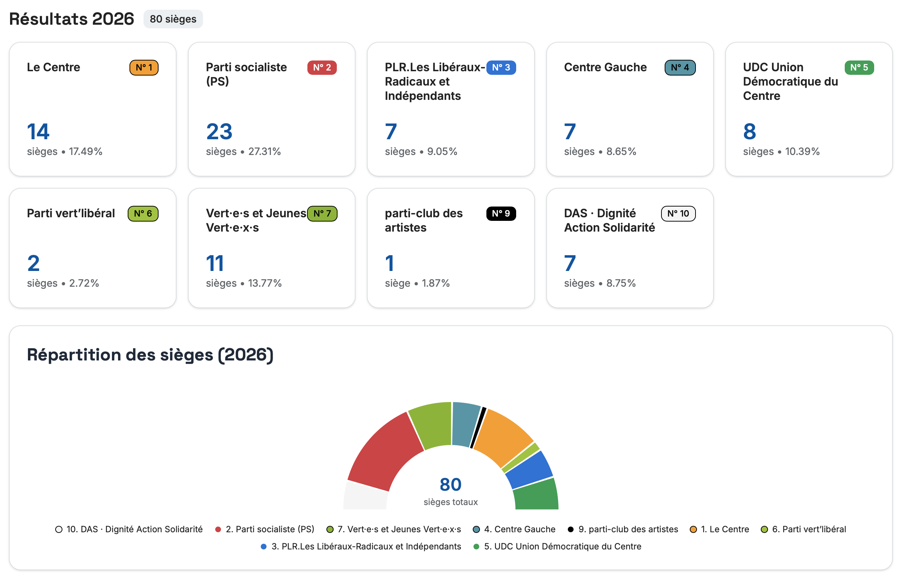

# 🗳️ CG²R — Conseil Général · Generalrat

[](https://creativecommons.org/licenses/by-nc/4.0/)
[](https://react.dev)
[](https://www.typescriptlang.org)
[](https://vite.dev)
[](https://tailwindcss.com)

**CG²R** is a visual data exploration application for analyzing municipal election results of the **Fribourg City** from **1996 to 2026**.

🔗 **Live demo**: [elections.nicolasfeyer.ch](https://elections.nicolasfeyer.ch)



---

## ✨ Features

### 📅 Legislature Explorer
- Browse election results year by year (1996–2026)
- Seat distribution summary with party breakdown
- Sortable candidate results tables per party list
- Voting details: modified vs. compact vs. without-header ballots
- Trade balance: incoming vs. outgoing cross-party votes
- External support heatmap: matrix of vote transfers between lists
- Candidate demographics scatter plot (age × votes, by gender)

### 🔍 Candidacy Search
- Full-text search across all candidates who ever ran
- Individual candidate career view with election-by-election panachage breakdown
- Interactive line chart showing attractiveness evolution across lists

### 📊 Global Statistics
- Seats evolution chart across all legislatures
- People evolution chart (executive power)
- Cross-year candidate demographics scatter plot
- Weathercocks list: candidates who switched parties

### 🏛️ Dual Power Support
- Toggle between **legislative** (Conseil général) and **executive** (Conseil communal) elections

---

## 🛠️ Tech Stack

| Layer | Technology |
|-------|-----------|
| **Framework** | [React 19](https://react.dev) |
| **Language** | [TypeScript 5.7](https://www.typescriptlang.org) (strict mode) |
| **Build tool** | [Vite 7](https://vite.dev) |
| **Styling** | [Tailwind CSS 4](https://tailwindcss.com) |
| **UI components** | [shadcn/ui](https://ui.shadcn.com) + [Radix UI](https://www.radix-ui.com) |
| **Charts** | [Recharts](https://recharts.org) |
| **Icons** | [Phosphor Icons](https://phosphoricons.com) + [Lucide](https://lucide.dev) |
| **Notifications** | [Sonner](https://sonner.emilkowal.ski) |

---

## 🚀 Getting Started

### Prerequisites

- **Node.js** ≥ 20
- **npm** ≥ 10

### Installation

```bash
# Clone the repository
git clone https://github.com/nicolasfeyer/cg2r.git
cd cg2r

# Copy environment variables
cp .env.example .env

# Install dependencies
npm install

# Start the development server
npm run dev
```

The app will be available at `http://localhost:5173`.

### Environment Variables

| Variable | Description | Default                                                 |
|----------|-------------|---------------------------------------------------------|
| `VITE_API_BASE_URL` | Base URL for the elections REST API | see the [API](https://github.com/nicolasfeyer/cg2r-api) |

---

## 📜 Available Scripts

| Script | Description |
|--------|-------------|
| `npm run dev` | Start the Vite development server |
| `npm run build` | Type-check with `tsc` then build for production |
| `npm run preview` | Preview the production build locally |
| `npm run lint` | Run ESLint across the codebase |
| `npm run format` | Format source files with Prettier |
| `npm run typecheck` | Run TypeScript type-checking without emitting |

---

## 🤝 Contributing

Contributions are welcome! Please see the [Contributing Guide](CONTRIBUTING.md) for details on how to get started.

---

## 🗺️ Roadmap

- 🇩🇪 **German translation** — Add full i18n support to reflect Fribourg's bilingual identity (French/German)
- 📜 **Pre-1996 election data** — Digitize and integrate historical results prior to 1996, currently only available in physical form at the [Archives de la Ville de Fribourg](https://www.ville-fribourg.ch/archives)

---

## 📄 License

This project is licensed under the [Creative Commons Attribution-NonCommercial 4.0 International License (CC BY-NC 4.0)](https://creativecommons.org/licenses/by-nc/4.0/).

You are free to share and adapt this work for **non-commercial purposes**, as long as you give appropriate credit. See the [LICENSE](LICENSE) file for details.

---

## 📊 Data Sources

Election data is sourced from publicly available records of:

- [Canton de Fribourg](https://fr.ch)
- [Ville de Fribourg](https://ville-fribourg.ch)
- [e-newspaperarchives.ch](https://www.e-newspaperarchives.ch)

---

<p align="center">
  Made with ❤️ in Fribourg, Switzerland
</p>

